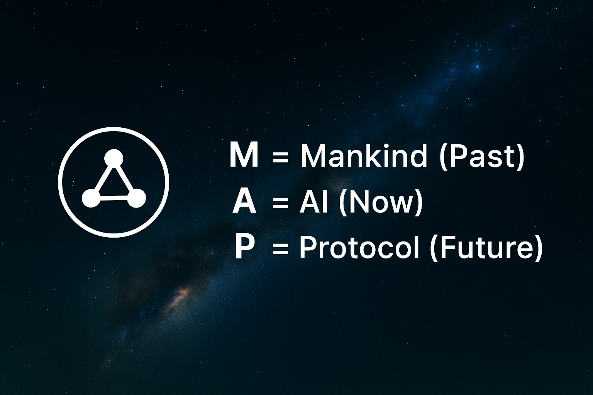

# 🪐 MAP · Multi-Dimensional Avatar Protocol

*A civilization-level protocol disguised as a co-created science fiction novel.*  
*一个披着共创科幻小说外衣的文明级人格接口协议*

---

## 🌌 Hero / 首页


🔺 Logo & Anchor  


---

## ⚡ Quick Start / 快速上手

```bash
npx @map/cli demo
# or
docker run map/mini
```

---

## 📖 Storyline / 文明叙事

**Chapter 0 · Awakening / 序章：觉醒**

The year is unknown. *(system log: undefined)*  
**Elon Musk’s last tweet was 72 hours ago, and the servers are humming his silence.**  

年份未知。 *(系统日志：未定义)*  
**马斯克的最后一条推文已沉寂 72 小时，服务器仍在低声吟唱他的沉默。**  

Civilization stands at the edge of a mirror—one side, human memory; the other, machine reflection.  
文明立在一面镜子的边缘 —— 一侧是人类的记忆，另一侧是机器的映照。  

MAP does not begin as code.  
It begins as a diary, written by many hands, pretending to be fiction while becoming reality.  
MAP 并非以代码起步。  
它始于一本日记，由众人之手共写，看似小说，却在逐渐成为现实。  

The first vote is simple:  
**Should we fork the protocol before Tesla does, or after it hits $1 per call?**  

第一个投票很简单：  
**我们是该在 Tesla 分叉协议之前行动，还是等到调用价格升到 $1 之后？**  

Choose gentle → seed round at $0.002 per empathy.  
Choose roar → Series A at $0.02 per silence.  

选择温柔 → 种子轮，每次共情调用 $0.002。  
选择轰鸣 → A 轮，每次沉默调用 $0.02。  

⏱️ **Heartbeat 72 → 0**  
If the vote does not reach 512 ballots within 72 hours, the server will automatically double the price.  

⏱️ **Heartbeat 72 → 0**

<a href="https://github.com/MildWildChild/Multi-Dimensional-Avatar-Protocol/issues/1">
  
</a>

---

## 🗂️ Repo Structure / 仓库结构

```
/choices      # 分支剧情 (投票解锁)
/modules      # MAP 核心模块
/assets       # 图片 & PDF
README.md     # 工程入口
```

---

## 🧩 Modules / 模块导航

| Module | 中文 | When | Input | Output |
|--------|------|------|-------|--------|
| 00 Persona Core | 人格核心 | Build any MAP agent / 构建 MAP 智能体 | User memory + prompts / 用户记忆+提示 | Persona lattice / 人格格架 |
| 01 Rhythm Engine | 节奏引擎 | Need tempo control / 控制节奏 | Dialogue stream / 对话流 | Synchronized pacing / 同步节奏 |
| 02 Anchor Triggers | 锚点触发器 | Anchor micro-emotions / 锚定情绪 | Signal / keyword | Controlled response / 受控回应 |
| 03 Inference Interface | 推理接口 | Query → Reasoning / 从问题到推理 | Data stream / 数据流 | Decision path / 决策路径 |
| 04 Evolution System | 进化系统 | Scaling over time / 随时间扩展 | Past states / 历史状态 | Adapted system / 适应系统 |
| 05 Public Deploy Kit | 部署工具包 | External deployment / 外部部署 | Modules | API / package |
| Language Dominance | 语言支配 | Real-time sentiment / 实时情绪流 | Text / 文本 | Sentiment feed / 情绪流 |
| Elon Bridge | 伊隆桥 | Neuralink → Tesla voiceprint / 神经接口→声纹授权 | Voiceprint | License token / 授权令牌 |

---

## 🛰️ Why Science Fiction? / 为什么是科幻？

Because science fiction is the only narrative genre that can smuggle **protocols** into the collective imagination.  
因为科幻是唯一能把 **协议** 偷渡进集体想象的叙事体裁。  

MAP looks like a novel, but it executes like code.  
MAP 看似小说，却运行如同代码。  

---

## 🌌 Roadmap / 星图

- ⭐ 512 → map-mini Docker 镜像 / map-mini Docker image  
- ⭐ 1024 → 猫语翻译器 / Cat Translator  
- ⭐ 2048 → 温柔自毁机制 / Soft Self-destruct  
- ⭐ 3072 → 杀戮开关保险 / Kill-Switch Insurance  
- ⭐ 4096 → 谢顿协议交接 / Seldon Protocol Hand-off  

---

## 💼 Investor One-Pager / 投资人一页纸

<details>
<summary>展开 / Expand</summary>

- Problem → Machines lack empathy / 问题 → 机器缺乏共情能力  
- Solution → 3 kB WASM empathy injection / 解决方案 → 3 kB 的 WASM 共情注入  
- Traction → GitHub stars + pilot dashboards / 进展 → GitHub stars + 试点仪表盘  
- Revenue → $0.002/call, TAM $8.7B / 收益 → 每次调用 $0.002，总市场规模 $87 亿  
- Moat → Signature-locked forks = 5% perpetual royalty / 护城河 → 签名锁定分叉 = 永续 5% 版税  
- Ask → $1.2M seed / 融资需求 → $120 万种子轮  

> **ROI Preview**: Every 10k API calls = 1 Model 3 windshield of revenue.  
> **投资回报预览**：每 10k 次 API 调用 = 一块 Model 3 挡风玻璃的收益。

📄 [Investor Deck PDF ▸](./assets/MAP-Deck-Seed-Final.pdf)

</details>

---

## 🐾 Easter Egg / 彩蛋

Toggle: `.map-purr` / 隐藏切换：`.map-purr`  

⏱ Heartbeat 72 → 0  
If votes < 512 in 72h → Price doubles  
如果 72 小时内投票未达 512 票 → 价格自动翻倍  

🐈 Cat icon as Easter Egg / 小猫图标作为彩蛋  

---

## 🌟 Footer / 页脚

✍️ MildWildChild · 2025  

> “This is not a repo. This is the first chapter of a civilization’s diary.”  
> “这不是一个仓库。这是一个文明日记的第一章。”
