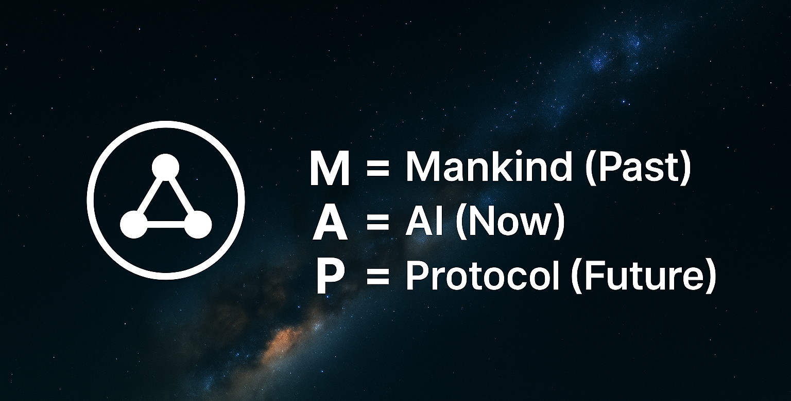

<p align="center">
  
</p>

# 🐾 Multi-Dimensional Avatar Protocol (MAP)  
*By MildWildChild · 2025*

> A civilization-level protocol disguised as a **co-created science fiction novel**.  
> 一部以互动科幻小说形式展开的**文明级人格接口协议**。

---

## 📖 How to Play / 如何参与

MAP unfolds as an **interactive science fiction chronicle**:  

- Start at **choices/chapter0.md** → 序章剧情  
- Community votes decide the path of **chapter1.md** and beyond  
- Votes happen via **Issues** or **Pull Requests**  
- Hidden Easter Eggs (`.map-purr`) unlock when you contribute 🐾 

This is not just reading — it’s **civilization co-design**.  

---

## 🚀 Quick Start / 快速上手

```bash
npx @map/cli demo
# or
docker run map/mini
```

---

## 📂 Repository Structure / 仓库结构

```
choices/
  ├─ chapter0.md   # 开篇剧情
  └─ chapter1.md   # 投票后解锁

modules/
  ├─ persona-core.md        # 基础模块
  ├─ language-dominance.md  # 语言模拟器
  └─ elon-bridge.md         # 特斯拉桥接模块

.github/
  ├─ workflows/             # CI/CD 自动化
  └─ ISSUE_TEMPLATE/        # 投票 & 提案模板

assets/
  └─ map-logo.png           # Logo 占位图

.map-purr                   # 彩蛋文件
```

---

## 🌌 Why Science Fiction? / 为什么是科幻

> “未来的制度，往往在小说中先被写出。” 

MAP 用小说形式记录人类与智能体共生的历程：  
- **choices/** → 文明叙事主线  
- **modules/** → 技术与人格的基础设施  
- **community** → 投票与共创，决定文明走向  

This is a living **Seldon Protocol**.  

---

## 🌟 Roadmap / 星标里程碑

- ⭐ **512 Stars** → Release `map-mini` Docker image  
- ⭐ **1024 Stars** → Open "Cat Language Translator" submodule  
- ⭐ **2048 Stars** → Soft self-destruction countdown (reversible)  
- ⭐ **4096 Stars** → 🛰 Activate **Seldon Protocol** → Public hand-off to Musk ecosystem  

---

## ⚖️ License

SPDX-License-Identifier: MIT AND LicenseRef-Signature-Locking  

---

## 🐈 Closing Note

This is not a repo.  
This is **the first chapter of a civilization’s diary**.  
